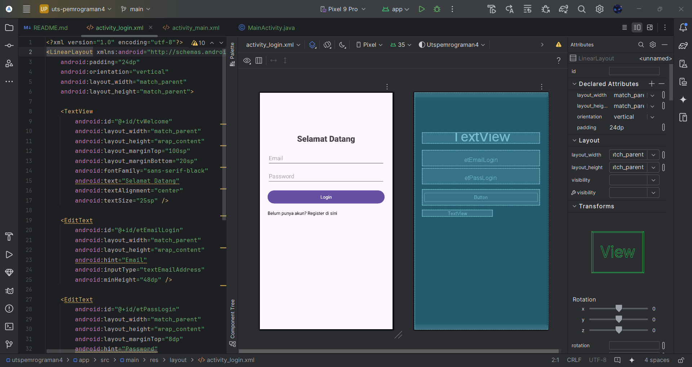
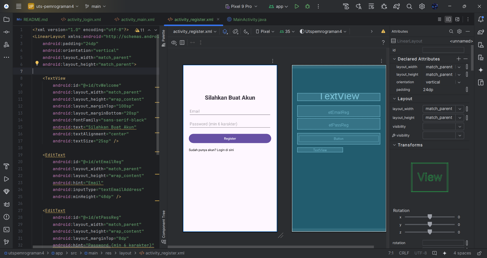
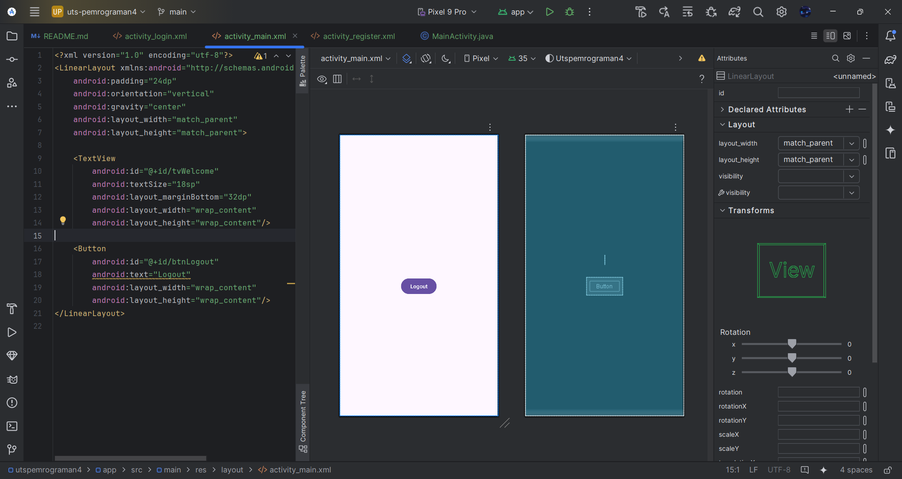
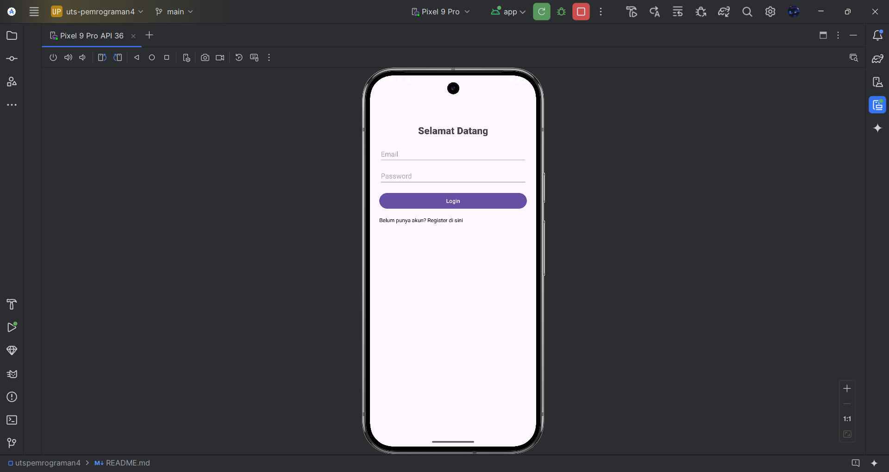
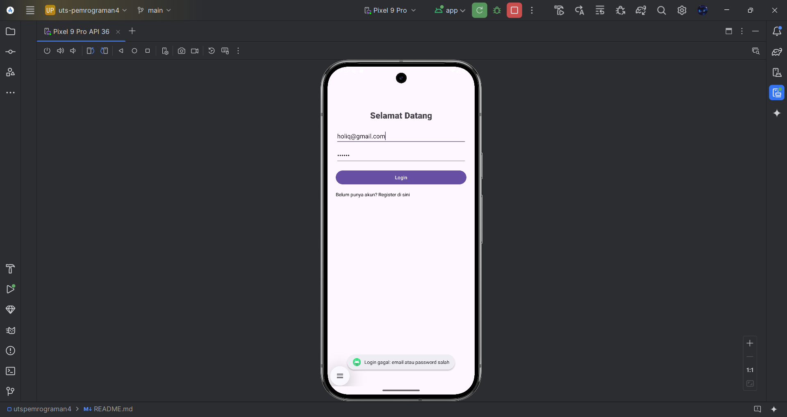
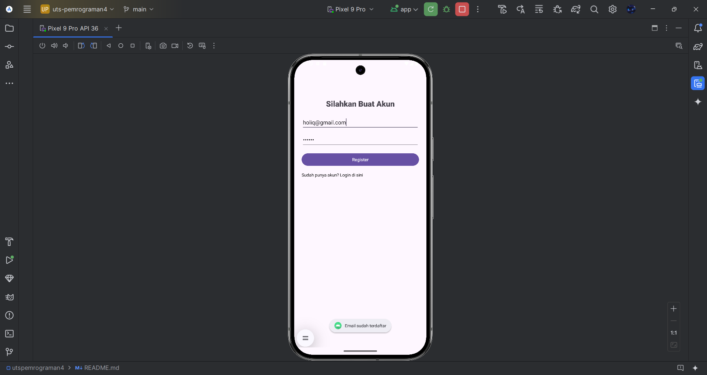
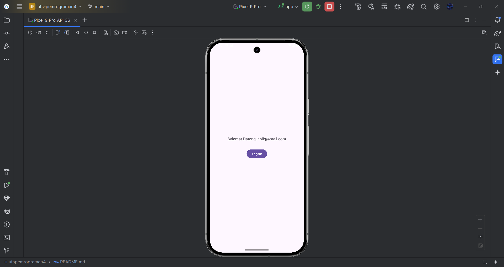

## Pemrograman4-UMB
Aplikasi Android sederhana untuk UTS Pemrograman 4 di Universitas Muhammadiyah Banten.
HOLIQ IBRAHIM - 220320002

### Fitur
- **Register**: Buat akun baru dengan email dan password.
- **Login**: Masuk ke aplikasi dengan akun terdaftar.
- **Logout**: Keluar dari aplikasi dan kembali ke layar login.

### Teknologi
- Bahasa: Java
- Database: SQLite (melalui `SQLiteOpenHelper`)
- Build system: Gradle

### Alur Aplikasi
- Buka aplikasi
- Login jika sudah ada akun, jika belum klik tidak punya akun
- Register jika belum punya akun, jika sudah klik login
- Halaman utama menampilkan Selamat Datang dan tombol Logout

### Screenshot

### Hasil Emulator

